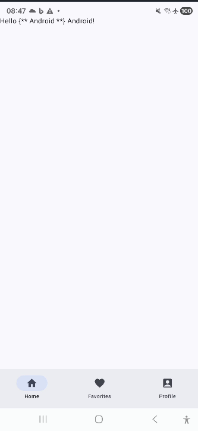

# RMGmuck1

This is a sample Android application built with Jetpack Compose that serves as a demonstration of modern Android app development practices.

## Features

*   **Single Activity Architecture:** The app uses a single `MainActivity` that hosts all composable screens.
*   **Jetpack Compose:** The UI is built entirely with Jetpack Compose, showcasing a declarative UI approach.
*   **Material 3:** The app utilizes the latest Material Design components for a modern and responsive user interface.
*   **Adaptive Navigation:** It features an adaptive navigation suite that adjusts to different screen sizes, providing an optimal user experience on phones, tablets, and foldables.
*   **Bottom Navigation:** A bottom navigation bar allows for easy switching between the app's main destinations: Home, Favorites, and Profile.

## Technologies Used

*   [Kotlin](https://kotlinlang.org/): The primary programming language for Android development.
*   [Jetpack Compose](https://developer.android.com/jetpack/compose): Android's modern toolkit for building native UI.
*   [Material 3](https://m3.material.io/): The latest version of Google's open-source design system.
*   [Android Studio](https://developer.android.com/studio): The official IDE for Android app development.
*   [Gradle](https://gradle.org/): The build automation tool used for this project.

## Getting Started

To get a local copy up and running, follow these simple steps.

### Prerequisites

*   Android Studio Iguana | 2023.2.1 or later.
*   An Android device or emulator running API level 21 or higher.

### Installation

1.  **Clone the repository:**
    ```sh
    git clone https://github.com/your-username/RMGmuck1.git
    ```
2.  **Open in Android Studio:**
    Open Android Studio, select "Open an Existing Project," and navigate to the cloned repository folder.
3.  **Build the project:**
    Android Studio will automatically sync the project with Gradle. Once the sync is complete, you can build the project by selecting `Build > Make Project` from the menu bar.
4.  **Run the app:**
    Select a run configuration (usually `app`) and a target device, then click the "Run" button.

## Project Structure

The project follows a standard Android app structure:

*   `app/src/main/java/au/roman/rmgmuck1`: Contains the main source code of the application.
    *   `MainActivity.kt`: The entry point of the application.
    *   `ui/theme/`: Contains theme-related files like `Color.kt`, `Theme.kt`, and `Type.kt`.
*   `app/build.gradle.kts`: The Gradle build script for the app module, where dependencies are declared.

## Screenshots



*(Note: You will need to take a screenshot of the app and add it to the project root as `screenshot.png` for the image to display.)*
